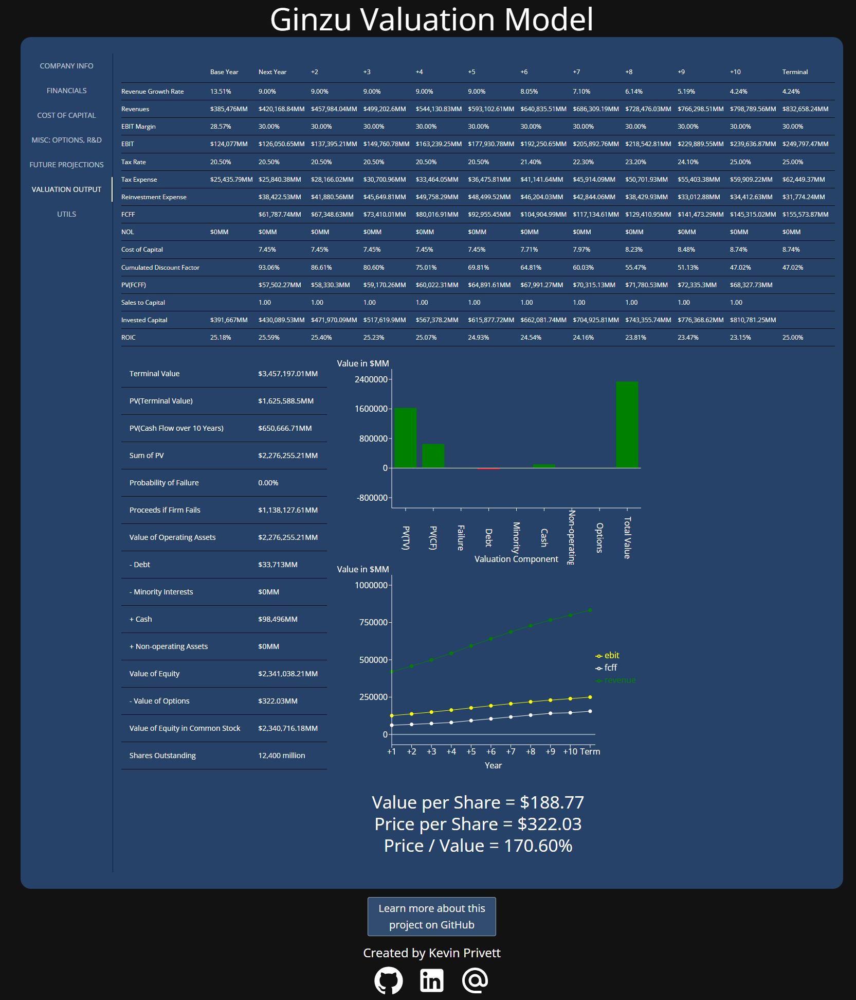

## Ginzu Valuation Model Web App

This web app uses a detailed discounted cash flow model in order to value US based public companies with a much more rigorous methodology and more control than other freely available valuation websites.

This web app is deployed on GitHub Pages and can be accessed here:
https://kevintprivett.github.io/Ginzu-Valuation/

Data used in this model is available on Professor Damodaran's website, along with an incredible amount of resources to learn about financial valuation:  
https://pages.stern.nyu.edu/~adamodar/

Professor Damodaran also has his own implementation of this model as a spreadsheet that he updates regularly:  
https://pages.stern.nyu.edu/~adamodar/pc/fcffsimpleginzu.xlsx

### Usage

Valuation requires a lot of data and unfortunately very little of that data is freely available programmatically, so this web app requires a fair amount of user input to value a company.  To quickly get started with a sample company, download [this file](sample/goog_data.json) for a valuation of Google and navigate to [Utils](https://kevintprivett.github.io/Ginzu-Valuation/#/utils) -> Import Company Data to upload the sample data.  You can then navigate to Valuation Output and see the results of the valuation.



While it is difficult to get programmatic access to financial data, the information is easily searchable, so there are helper search links throughout the web app to access stock pricing information, historical financial data, and SEC filings which will help you quickly access the data you need to complete a full valuation.

To get the most accurate valuations, I recommend to use the detailed approaches (which are selected by default) and to fill out all information that is available.

The [Future Projections](https://kevintprivett.github.io/Ginzu-Valuation/#/future-projections) panel is the most important and most difficult to fill out.  It is not easy (impossible??) to get reliable future projections so you should spend some time researching the company and thinking critically about what the future might hold for this company.  The overrides should only be used in extreme circumstances and may very well break the financial model.  The only override I would recommend using is Return on Capital as it is reasonable to assume that some capital light companies can maintain high levels of Return on Capital in the future.

Some inputs are a little hard to find.  You'll need to dig through the footnotes of the most recent 10k in order to find things like employee options and average maturity of debt.

There are a few variables in this model that are very important but may not be well known:
  - RFR: Risk Free Rate.  This is a measure of the expected return for a completely riskless investment.  Traditionally, the US 10 year treasury rate is used.  This number is automatically updated weekly in this web app.
  - ERP: Equity Risk Premium.  This is the expected return on equities (stocks) above the risk free rate.  This is a critical measure of the price of risk in the market and this number is calculated and provided monthly by Professor Damodaran [here](https://pages.stern.nyu.edu/~adamodar/).
  - Sales to Capital Ratio: Annual Revenue / Invested Capital.  This is not a particularly common ratio but it is a great way to easily quantify the costs associated with revenue growth.  Review how the company's Sales to Capital Ratio evolved over previous years as well as the industry average to get an idea of how efficiently the company is able to grow revenue.

The web app will cache the company data so you should be able to leave the site and return and have all of your previous work available.  If you go to [Utils](https://kevintprivett.github.io/Ginzu-Valuation/#/utils) you'll be able to export and import company data files.

### Tech Stack

Due to the long-lived data used for this project, it's able to be a front-end only web app with data updates injected in at regular intervals

#### Front-End:
  - **React 19**
  - Vite, Vitest, Redux, MUI, Recharts

#### Pipeline:
  - **Python 3**
  - BeautifulSoup4, Jupyter, Numpy, Pandas
  - Weekly and Monthly updates are run through GitHub Actions

### Local Setup

#### FrontEnd

Run the following to setup of the front end locally:

```
cd FrontEnd
npm install
```

Available commands:

```
npm run dev
npm run build
npm run preview
npm run lint
npm run test
npm run format
npm run coverage
```

#### Pipeline

Run the following commands to set up the pipeline locally:

```
cd Pipeline
python -m venv .venv
source .venv/bin/activate
pip install -r requirements.txt
```

Various pipelines to update [marketData.json].

[market_data_pipeline.ipynb] should be run yearly, usually around late January, depending on when Prof. Damodaran makes his data updates.  It should be run one cell at a time as the data tables may be formatted differently year to year.

[erp_update.py] is ran automatically on a github action workflow to update erp on a monthly basis.

[rfr_update.py] will update the risk free rate and can be set to either update [marketData.json] or to insert the data into the BackEnd SQLite database using the --sqlite flag.  [run_rfr_update_sqlite.sh] will automate this process when paired with a cron job.

[sec_update_pipeline.py] will download a daily SEC zip file and process it into json files that match what is needed for the FrontEnd and load everything into the SQLite database.  [Run_sec_update_pipeline.sh] will automate this process when paired with a cron job.

### Future Enhancements

  - [x] Process [SEC data](https://www.sec.gov/search-filings/edgar-application-programming-interfaces) into a backend that can provide the relevant financial data to this web app.
  - [ ] Sensitivity Analysis
  - [ ] Monte Carlo Analysis
  - [ ] Better support for international companies
  - [ ] Add helper text for all fields to help cut through some of the jargon 